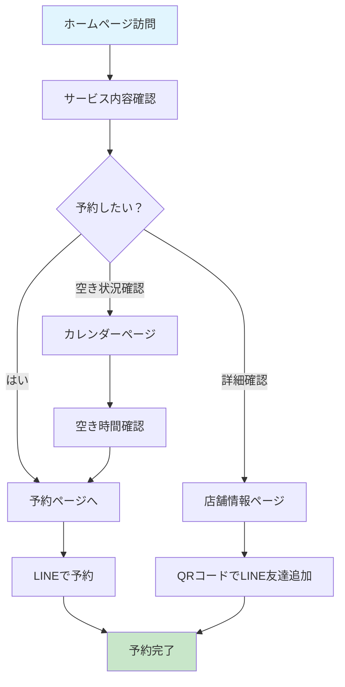
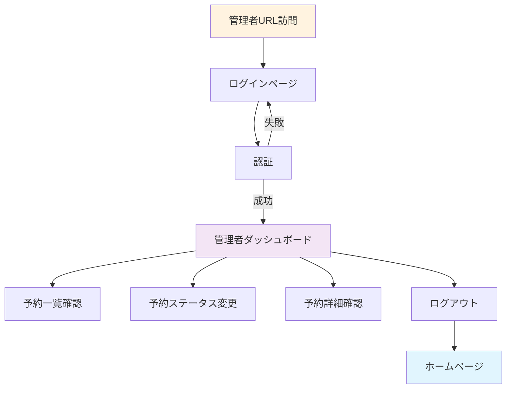

# yoon² イヤーエステサロン ホームページ - 画面フロー設計書

## 概要

このドキュメントは、イヤーエステサロン「yoon² ユンユン」のホームページの画面フローと各ページの詳細について説明します。

## サイトマップ

```
yoon² ホームページ
├── 🏠 ホーム (/)
├── 🏪 店舗情報 (/shop)
├── 📅 予約状況 (/calendar)
├── 📝 予約・お問い合わせ (/booking)
│   └── ✅ 予約確認 (/booking-confirmation)
└── 🔐 管理者エリア
    ├── 🔑 管理者ログイン (?admin=login)
    └── 📊 管理者ダッシュボード (/admin-dashboard)
```

## ユーザージャーニー

### 一般ユーザー（お客様）のフロー



### 管理者のフロー



## 画面詳細設計

### 1. ホームページ (`/` - Home.js)

#### 目的
- サロンの魅力を伝える
- サービス内容の紹介
- 予約への導線作り

#### 構成要素
```
┌─────────────────────────────────────┐
│            Header                   │
├─────────────────────────────────────┤
│         Hero Section                │
│  • サロン名「yoon²」                │
│  • キャッチコピー                    │
│  • CTAボタン（LINEで予約）           │
│  • 店舗情報ボタン                    │
├─────────────────────────────────────┤
│        About Section                │
│  • サービスの特徴                    │
│  • サロンの紹介文                    │
│  • イメージ画像                      │
├─────────────────────────────────────┤
│        Menu Section                 │
│  • おすすめメニュー                  │
│  • 耳つぼメニュー                    │
│  • イヤーエステ・ドライヘッドスパ    │
│  • 各メニューの料金・時間            │
├─────────────────────────────────────┤
│       Social Section                │
│  • Instagram連携                    │
│  • SNS投稿表示                      │
├─────────────────────────────────────┤
│            Footer                   │
└─────────────────────────────────────┘
```

#### 主要機能
- **レスポンシブデザイン**: モバイル・タブレット・デスクトップ対応
- **アニメーション**: スクロール時のフェードイン効果
- **CTA**: 予約ボタンで予約ページへ誘導
- **メニュー表示**: appConfig.jsから動的にメニュー情報を取得

#### ナビゲーション
- `予約ボタン` → 予約ページ
- `店舗情報ボタン` → 店舗情報ページ
- `ヘッダーナビ` → 各ページへ

---

### 2. 店舗情報ページ (`/shop` - ShopInfo.js)

#### 目的
- 店舗の詳細情報提供
- アクセス方法の案内
- 営業時間・料金の明示

#### 構成要素
```
┌─────────────────────────────────────┐
│            Header                   │
├─────────────────────────────────────┤
│         Hero Section                │
│  • ページタイトル「店舗情報」        │
│  • サブタイトル                      │
├─────────────────────────────────────┤
│      Shop Overview                  │
│  • サロン名・概要                    │
│  • サービス説明                      │
├─────────────────────────────────────┤
│       Access Section                │
│  • 住所・電話番号                    │
│  • 最寄り駅情報                      │
│  • 地図プレースホルダー              │
├─────────────────────────────────────┤
│    Business Hours Section           │
│  • 営業時間（平日・土日祝）          │
│  • 定休日情報                        │
│  • 注意事項                          │
├─────────────────────────────────────┤
│      Services Section               │
│  • 全サービスメニュー一覧            │
│  • 料金・時間詳細                    │
├─────────────────────────────────────┤
│      QR Codes Section               │
│  • LINE QRコード                    │
│  • Instagram QRコード               │
│  • 連絡方法の説明                    │
├─────────────────────────────────────┤
│            Footer                   │
└─────────────────────────────────────┘
```

#### 主要機能
- **動的データ表示**: appConfig.jsから店舗情報を取得
- **QRコード表示**: LINE・Instagram連携
- **電話番号リンク**: タップで電話アプリ起動
- **アクセシビリティ**: 電話対応不可の明記

#### ナビゲーション
- `LINEで予約ボタン` → 外部LINE
- `Instagramボタン` → 外部Instagram
- `ヘッダーナビ` → 各ページへ

---

### 3. 予約状況ページ (`/calendar` - CalendarPage.js)

#### 目的
- 予約可能日時の表示
- 空き状況の確認
- 予約への誘導

#### 構成要素
```
┌─────────────────────────────────────┐
│            Header                   │
├─────────────────────────────────────┤
│         Hero Section                │
│  • ページタイトル「予約状況」        │
├─────────────────────────────────────┤
│      Calendar Section               │
│  • カレンダー表示                    │
│  • 日付選択機能                      │
│  • 空き時間表示                      │
├─────────────────────────────────────┤
│    Available Times Section          │
│  • 選択日の空き時間一覧              │
│  • 予約済み時間の表示                │
├─────────────────────────────────────┤
│      Booking CTA Section            │
│  • 予約ボタン                        │
│  • LINE予約への誘導                  │
├─────────────────────────────────────┤
│            Footer                   │
└─────────────────────────────────────┘
```

#### 主要機能
- **リアルタイム空き状況**: Firestoreから予約データ取得
- **日付選択**: React Calendarコンポーネント
- **時間表示**: 営業時間内の空き時間を表示
- **予約誘導**: LINEでの予約方法案内

#### データフロー
```
Calendar Component → bookingService.getAvailableTimes() → Firestore → 空き時間表示
```

---

### 4. 予約・お問い合わせページ (`/booking` - Booking.js)

#### 目的
- 予約方法の案内
- よくある質問の回答
- 来店前の注意事項

#### 構成要素
```
┌─────────────────────────────────────┐
│            Header                   │
├─────────────────────────────────────┤
│         Hero Section                │
│  • ページタイトル                    │
│  • LINE予約の案内                   │
├─────────────────────────────────────┤
│     Booking Form Section            │
│  • 予約フォーム（BookingForm）      │
│  • LINE誘導メッセージ               │
├─────────────────────────────────────┤
│     Booking Flow Section            │
│  • 予約の流れ（3ステップ）           │
│  • 1. LINE友達追加                  │
│  • 2. メッセージ送信                │
│  • 3. 予約確定                      │
├─────────────────────────────────────┤
│         FAQ Section                 │
│  • よくある質問と回答                │
│  • 変更・キャンセル                  │
│  • 支払い方法                        │
│  • 駐車場情報                        │
├─────────────────────────────────────┤
│        Notes Section                │
│  • 来店前のお願い                    │
│  • 服装・メイク・体調について        │
├─────────────────────────────────────┤
│            Footer                   │
└─────────────────────────────────────┘
```

#### 主要機能
- **予約フォーム**: BookingFormコンポーネント
- **LINE誘導**: 実際の予約はLINEで行う旨を明記
- **FAQ**: よくある質問で不安を解消
- **注意事項**: 来店前の準備事項を明示

---

### 5. 予約確認ページ (`/booking-confirmation` - BookingConfirmation.js)

#### 目的
- 予約完了の確認
- 予約内容の表示
- 次のステップの案内

#### 構成要素
```
┌─────────────────────────────────────┐
│            Header                   │
├─────────────────────────────────────┤
│    Confirmation Section             │
│  • 予約完了メッセージ                │
│  • 予約内容詳細                      │
│  • 予約ID・日時・サービス            │
├─────────────────────────────────────┤
│      Next Steps Section             │
│  • 来店までの流れ                    │
│  • 連絡方法                          │
│  • 変更・キャンセル方法              │
├─────────────────────────────────────┤
│       Contact Section               │
│  • LINE連絡先                       │
│  • 緊急時の対応                      │
├─────────────────────────────────────┤
│            Footer                   │
└─────────────────────────────────────┘
```

#### 主要機能
- **予約詳細表示**: URLパラメータから予約情報取得
- **確認メール**: 将来的にメール送信機能
- **LINE連携**: 予約後のやり取りはLINEで

---

### 6. 管理者ログインページ (`?admin=login` - AdminLogin.js)

#### 目的
- 管理者認証
- セキュアなアクセス制御

#### 構成要素
```
┌─────────────────────────────────────┐
│         Login Form                  │
│  • メールアドレス入力                │
│  • パスワード入力                    │
│  • ログインボタン                    │
│  • エラーメッセージ表示              │
└─────────────────────────────────────┘
```

#### 主要機能
- **Firebase Authentication**: メール・パスワード認証
- **ロール確認**: 管理者権限のチェック
- **セキュリティ**: 非管理者はアクセス拒否
- **エラーハンドリング**: 認証失敗時の適切なメッセージ

#### 認証フロー
```
Login Form → authService.signInAdmin() → Firebase Auth → 
Role Check → Admin Dashboard or Error
```

---

### 7. 管理者ダッシュボード (`/admin-dashboard` - AdminDashboard.js)

#### 目的
- 予約管理
- 顧客情報確認
- 業務効率化

#### 構成要素
```
┌─────────────────────────────────────┐
│         Admin Header                │
│  • 管理者メニュー                    │
│  • ログアウトボタン                  │
├─────────────────────────────────────┤
│      Dashboard Overview             │
│  • 今日の予約件数                    │
│  • 月間予約統計                      │
│  • 売上概要                          │
├─────────────────────────────────────┤
│      Booking Management             │
│  • 予約一覧テーブル                  │
│  • フィルター機能                    │
│    - 日付範囲                       │
│    - ステータス                      │
│    - サービス種別                    │
├─────────────────────────────────────┤
│      Booking Actions                │
│  • ステータス変更                    │
│    - pending → confirmed            │
│    - confirmed → completed          │
│    - any → cancelled               │
│  • 予約詳細表示                      │
│  • 顧客情報確認                      │
├─────────────────────────────────────┤
│       Quick Actions                 │
│  • 新規予約追加                      │
│  • カレンダー表示                    │
│  • 設定変更                          │
└─────────────────────────────────────┘
```

#### 主要機能
- **リアルタイム予約管理**: Firestoreからデータ取得
- **ステータス管理**: pending/confirmed/cancelled/completed
- **フィルタリング**: 日付・ステータス・サービス別
- **予約詳細**: モーダルで詳細情報表示
- **一括操作**: 複数予約の一括処理（将来実装）

#### データ操作
```
Dashboard → bookingService → Firestore
├── getAllBookings() - 全予約取得
├── updateBooking() - ステータス更新
├── cancelBooking() - 予約キャンセル
└── getBookingsByDate() - 日付別取得
```

---

## ルーティング設計

### 現在の実装（独自ルーティング）

```javascript
// App.js内のルーティング
const renderPage = () => {
  switch (currentPage) {
    case 'shop': return <ShopInfo />;
    case 'booking': return <Booking />;
    case 'booking-confirmation': return <BookingConfirmation />;
    case 'calendar': return <CalendarPage />;
    case 'admin-login': return <AdminLogin />;
    case 'admin-dashboard': return <AdminDashboard />;
    default: return <Home />;
  }
};
```

### URL構造
```
https://yoon2-salon.web.app/
├── / (home)
├── ?page=shop (店舗情報)
├── ?page=booking (予約)
├── ?page=booking-confirmation (予約確認)
├── ?page=calendar (カレンダー)
├── ?admin=login (管理者ログイン)
└── /admin-dashboard (管理者ダッシュボード)
```

### 将来のReact Router実装案
```javascript
<Routes>
  <Route path="/" element={<Home />} />
  <Route path="/shop" element={<ShopInfo />} />
  <Route path="/booking" element={<Booking />} />
  <Route path="/booking/:id/confirmation" element={<BookingConfirmation />} />
  <Route path="/calendar" element={<CalendarPage />} />
  <Route path="/admin/login" element={<AdminLogin />} />
  <Route path="/admin/dashboard" element={
    <ProtectedRoute><AdminDashboard /></ProtectedRoute>
  } />
</Routes>
```

---

## レスポンシブデザイン

### ブレークポイント
```css
/* Mobile First */
.container {
  /* Base: Mobile (320px~) */
}

@media (min-width: 768px) {
  /* Tablet */
}

@media (min-width: 1024px) {
  /* Desktop */
}

@media (min-width: 1440px) {
  /* Large Desktop */
}
```

### モバイル対応
- **ハンバーガーメニュー**: モバイルでのナビゲーション
- **タッチ操作**: ボタンサイズ・間隔の最適化
- **スクロール**: 縦スクロール中心の設計
- **フォーム**: モバイルキーボード対応

---

## アクセシビリティ

### 実装済み機能
- **セマンティックHTML**: 適切なタグ使用
- **キーボードナビゲーション**: Tab移動対応
- **ARIA属性**: スクリーンリーダー対応
- **カラーコントラスト**: WCAG準拠

### 今後の改善予定
- [ ] フォーカス表示の強化
- [ ] 音声読み上げ対応
- [ ] 高コントラストモード
- [ ] 文字サイズ変更機能

---

## パフォーマンス最適化

### 実装済み
- **画像最適化**: WebP形式・適切なサイズ
- **遅延読み込み**: Intersection Observer使用
- **アニメーション**: CSS transform使用

### 今後の改善
- [ ] Code Splitting
- [ ] Service Worker
- [ ] CDN最適化
- [ ] Bundle Size削減

---

## SEO対策

### 現在の実装
- **メタタグ**: title, description設定
- **構造化データ**: JSON-LD（将来実装）
- **サイトマップ**: XML生成（将来実装）

### 改善予定
- [ ] 動的メタタグ
- [ ] OGP設定
- [ ] Google Analytics連携
- [ ] Search Console設定

---

## エラーハンドリング

### フロントエンド
```javascript
// 一般的なエラーハンドリングパターン
try {
  const result = await apiCall();
  // 成功処理
} catch (error) {
  console.error('エラー:', error);
  // ユーザーフレンドリーなエラーメッセージ表示
}
```

### バックエンド（Firebase）
- **Firestore Rules**: 不正アクセス防止
- **Auth Error**: 認証エラーの適切な処理
- **Network Error**: オフライン対応

---

## 今後の機能拡張

### 短期（3ヶ月以内）
- [ ] React Router導入
- [ ] メール通知システム
- [ ] Google Calendar連携
- [ ] 顧客管理機能強化

### 中期（6ヶ月以内）
- [ ] 決済システム連携
- [ ] 会員制度
- [ ] ポイントシステム
- [ ] レビュー・評価機能

### 長期（1年以内）
- [ ] モバイルアプリ（React Native）
- [ ] AI チャットボット
- [ ] 多言語対応
- [ ] 店舗拡張対応

---

このドキュメントは、プロジェクトの進行に合わせて継続的に更新されます。
